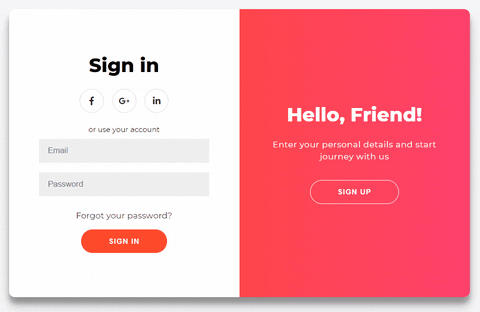

## Well Hello there! :wave: This repository is not only meant to showcase my Fully Fuctional Form but to also show that how to create a repository on GitHub with some Proffesional touch to begin with.

# :ledger: Fully Functional Form for login and Sign Up.

Below you can see an animation of what i have created:-



# :books: The Project Description

Before we actually get into the code, I'd like to break down the code in sections. This will hep us to write the code in more organized way.


We have 4 smaller **boxes** inside the main component (  the ```.container```  ):

1. The Sign In form
2. The Sign Up form
3. The Sign In overlay
4. The Sign Up overlay

Also, at one moment in time you can see either:

   - The Sign In form alongside the Sign Up overlay
   - The Sign Up form alongside the Sign In overlay
   
In the overlay panels we have some text and a ````button```` - by clicking it you will bring up the other combination of screens and vice-versa. Check the GIF above one more time to see what I mean.

# :label: The forms animation-explained

These aren't difficult to understand at all. Basically we have again two containers - the ``.form-container``s - each having a ``width`` of ``50%`` and a ``position`` - ``absolute``. We move both of them at the same time from the left to the right, and when they get behind the ``.overlay-container`` from above (while these are moving) we quickly change the ``z-index`` value so the **Sign Up** form (for example) will move on top of the **Sign In** form, and vice-versa. Magic to the eyes, but just some code logic behind!:laughing:

# :clipboard: The HTML & Javascript

Now that we have broken down the core "functionality" of the animation, it's time to see the actual HTML code. Let's start with the basic skeleton:

```html
<div class="container" id="container">
    <div class="form-container sign-up-container">
        <!-- Sign Up form code goes here -->
    </div>
    <div class="form-container sign-in-container">
        <!-- Sign In form code goes here -->
    </div>
    <div class="overlay-container">
        <!-- The overlay code goes here -->
    </div>
</div>
```

The main div has a class of ``.container`` and also an id of ``container`` because we want to target this element in the JavaScript (more on this below).😉

### The Sign Up form

```html
<div class="form-container sign-up-container">
    <form action="#">
        <h1>Create Account</h1>
        <div class="social-container">
            <a href="#" class="social"><i class="fab fa-facebook-f"></i></a>
            <a href="#" class="social"><i class="fab fa-google-plus-g"></i></a>
            <a href="#" class="social"><i class="fab fa-linkedin-in"></i></a>
        </div>
        <span>or use your email for registration</span>
        <input type="text" placeholder="Name" />
        <input type="email" placeholder="Email" />
        <input type="password" placeholder="Password" />
        <button>Sign Up</button>
    </form>
</div>
```

### The Sign In form

```html
<div class="form-container sign-in-container">
    <form action="#">
        <h1>Sign in</h1>
        <div class="social-container">
            <a href="#" class="social"><i class="fab fa-facebook-f"></i></a>
            <a href="#" class="social"><i class="fab fa-google-plus-g"></i></a>
            <a href="#" class="social"><i class="fab fa-linkedin-in"></i></a>
        </div>
        <span>or use your account</span>
        <input type="email" placeholder="Email" />
        <input type="password" placeholder="Password" />
        <a href="#">Forgot your password?</a>
        <button>Sign In</button>
    </form>
</div>
```

### The Overlay container

```html
<div class="overlay-container">
    <div class="overlay">
        <div class="overlay-panel overlay-left">
            <h1>Welcome Back!</h1>
            <p>
                To keep connected with us please login with your personal info
            </p>
            <button class="ghost" id="signIn">Sign In</button>
        </div>
        <div class="overlay-panel overlay-right">
            <h1>Hello, Friend!</h1>
            <p>Enter your personal details and start journey with us</p>
            <button class="ghost" id="signUp">Sign Up</button>
        </div>
    </div>
</div>
```

### The Javascript

```html
const signUpButton = document.getElementById('signUp');
const signInButton = document.getElementById('signIn');
const container = document.getElementById('container');

signUpButton.addEventListener('click', () => {
    container.classList.add('right-panel-active');
});

signInButton.addEventListener('click', () => {
    container.classList.remove('right-panel-active');
});
```

Now, once we are done with the html and the scripting part .Let's design this by moving on to css part.

# :clipboard: And then i have designed it through CSS

Finally! :sweat_smile::dash: We covered everything. We're done! 👏


# Conclusion

This post was a long one, wasn't it? 😅 Nevertheless, I'd hope you learned something from it. Everyone feel free to create your own version by using the code and share it with me on Instagram: [@younglord_d9](https://www.instagram.com/younglord_d9/).

Thank you 🙏!
